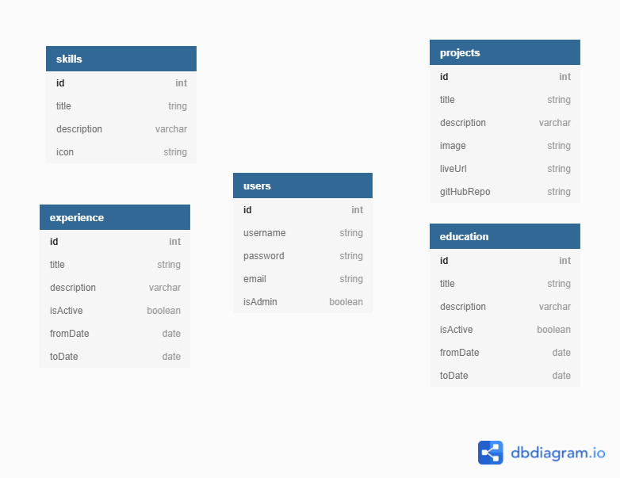
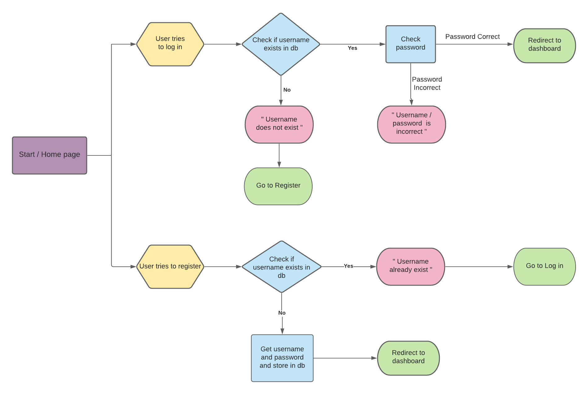

# **My Portfolio**

## **About for the project**
This project is a personal portfolio website that will showcase my software development skills and my recent projects to potential employers, potential clients or other developers. It will also serve as one of the milestone projects for the Code Institute Software Development Diploma course, where I needed to showcase what I've learned from the Python/Flask/MongoDB backend modules. 

The idea was that the website has a log in option so that users can add to the website, change something depending on their credentials. So myself as an **admin** will have rights to make changes to all sections that have that option, while the **guest** user will be able to add only testimonials after they have worked with me or hired me for a job. 

## Table of contents 
* [UX](#ux)
* [The Strategy Plane](#the-strategy-plane)
    * [User Goals](#user-goals)
    * [Site Owners Goals](#site-owners-goals)
    * [User Stories](#user-stories)
       * [Recruiters and Employers](#recruiters-and-employers)
        * [Other Developers](#other-developers)
        * [Potential Clients](#potential-clients)
* [The Scope Plane](#the-scope-plane)
    * [Existing Features](#existing-features)
    * [Features to be implemented](#features-to-be-implemented)
* [The Structure Plane](#the-structure-plane)
* [The Skeleton Plane](#the-skeleton-plane)
    * [Wireframes](#wireframes)
    * [Flowcharts](#flowcharts)
    * [Database Structure](#database-structure)
* [The Surface Plane](#the-surface-plane)
    * [Design Choices](#design-choices)
        * [Fonts](#fonts)
        * [Colors](#colors)
* [Technologies used](#technologies-used)
    * [Languages](#languages)
    * [Libraries and Frameworks](#libraries-and-frameworks)
    * [Tools](#tools)
* [Testing](#testing)
* [Deployment](#deployment)
    * [Heroku Deployment](#heroku-deployment)
    * [Run Locally](#run-locally)
    
* [Credits](#credits)

--- 

# **UX**

## **The Strategy Plane**

### **User Goals**

Users can be divided into three categories:

* ### **Recruiters and potential employers**
  The user, in this case, is a person who is looking to hire a developer and on this website, they need to be able to find all the information necessary for them to decide to invite me for an interview or offer me a job. 
  * Users goal is to be able to find skills and experience to see if it suits the role they have in mind.
  * Users goal is to be able to see projects that I've worked on to see what type of work I've done and if it is something similar they would need from me
  * Users goal is to see my previous employment to get a feel if someone my experience would be a good fit for their team
  * Users goal is to be able to find the contact information easily and contact me without leaving the page 
  * User goal is to be able to download my CV with one click 

* ### **Other developers** 
The user, in this case, is another developer who is looking for someone to work on a project with or a collaboration of some sort.
* This user's goal is to be able to see what skills and languages I know to see if we could work well together
* Users goal is to be able to find my GitHub profile to see the way I write my code and if this would suit their project
* Users goal is to find contact information easily and contact me from the website directly

* ### **Potential Clients**
The user in this case can be a person, a company, an artist, a small business, etc., who is lookig to hire someone to create their website, an app or change their existing website, etc. 

* This user's goal is to be able to see the projects that I have  created before, to see if they would like to hire me for their project
* This user's goal is to be able to see the testimonials from others that have worked with me, to evaluate if they want to hire me

* This user's goal is to be able to find the contact information easily and contact the site owner without leaving the page 

[Back to Top](#table-of-contents)

### **Site owners Goals**

My the goal is to have a beautiful and reponsive website that represents me as a person and also as a developer. I'd like potential employers to find it interesting enough to want to explore it and find out about me, my accomplishments, my skills, and that they will want to get in touch for an interview, a project, or a collaboration as a result.   

Apart from the other users, I will be a user as well.  As a user, (admin) I want to be be able to log in and make changes to the website, for example, add a new skill, add a new project, new job etc., directly from the page, without needing to change the code. 

### **User Stories**
  
#### **Recruiters and Employers** 

* As a busy user, I am using a lot of devices and I would like to be able to see this page equally well on any device I am currently using

* As a user, I would like the site to be intuitive and have easy navigation so that I can quickly and easily access the information I am looking for

* As a user, I would like to see the information about the site owner, to see how they present themselves and how they look like

* As a user, I would like to be able to see the site owners past experiences and their projects to see if the skills they have match the role I am looking to fill

* As a user, I would like to see site owners the LinkedIn page

* As a user, I would like to be able to contact the site owner easily and without leaving the page

* As a user, I would like to be able to find and download the site owners CV quickly and download it with one click

 
#### **Other Developers** 

* As a user, I would like to see the projects site owner was working on and the skills they have, to see if we could potentially work together on a project

* As a user, I would like to be able to see the site owners GitHub link to see how they are putting their skills to use and how their skills developed over time

#### **Potential Clients**

* As a user I would like to be able to see the projects that the site owner has made, to see if I would like to hire them for my project

* As a user, I would like to see the testimonials from people that have worked with the site owner, to confirm my decision for choosing them for my project

* As a user, I would like to be able to find the contact details easily, and contact the site owner without leaving the page 

[Back to Top](#table-of-contents)

## **The Scope Plane**

## **Features**

### **Existing Features**

* Responsive design
* Registration functionality
* Log In and Out functionality
* Dashboard where user can see what they can add/edit with their credentials
* As admin: 
    * CRUD Functions
        * Create: create a new skill
        * Read: after creating a skill, user can click View Skills button and is directed to the index page, the skill section, where they can see the skill they've just added 
        * Update: possibility to edit the skill
        * Delete: possibility to delete the skill

* As a user: 
    * CRUD Functions
        * Create: create a new testimonial
        * Read: after creating a testimonial, user can click View Testimonials button and will be directed to the index page, the testimonial section, where they can see the testimonial they've just added 
        * Update: possibility to edit the skill
        * Delete: possibility to delete the skill

* Users can click on email address in the contact section and will be directed to the email provider so they can send an email directly from the website

### **Features to be implemented**

In the future I would like to add an option for admin to be able to add and edit a New Project, new Employment and Education details.

I would also like to add a form in contact section so people can have that option as well to contact me  without leaving the page.

[Back to Top](#table-of-contents)

## **The Structure Plane**

## **The Skeleton Plane**

### **Database Schema**

### **Flowchart**

### **Wireframes**

#### Index Page Wireframes
[Hello Section](static/images/wireframes/hello.png)\
[About Me Section](static/images/wireframes/about-me.png)\
[My Projects Section](static/images/wireframes/my-projects.png)\
[Testimonials Section](static/images/wireframes/testimonials.png)

#### Admin Login Pages Wireframes
[Register](static/images/wireframes/dashboard.png)\
[Login](static/images/wireframes/login.png)\
[Dashboard](static/images/wireframes/dashboard.png)
#### CRUD Operations Pages Wireframes
[Add / Edit Skill](static/images/wireframes/add_edit_skill.png)\
[Add / Edit Testimonial](static/images/wireframes/add_edit_skill.png)

## **The Surface Plane**

### **Design Choices**

#### Colors

#### Typography

[Back to Top](#table-of-contents)

---

# **Technologies used**

### **Languages**

* [HTML](https://en.wikipedia.org/wiki/HTML)
* [CSS](https://en.wikipedia.org/wiki/Cascading_Style_Sheets)
* [JavaScript](https://en.wikipedia.org/wiki/JavaScript)
* [Python](https://www.python.org/)

### **Libraries and Frameworks**

* [Font Awesome](https://fontawesome.com/)
* [Bootstrap](https://getbootstrap.com/)
* [Google Fonts](https://fonts.google.com/)
* [jQuery](https://jquery.com/)

### **Tools**
* [Git](https://git-scm.com/)
* [GitPod](https://www.gitpod.io/)
* [Heroku](https://www.heroku.com/)
* [Balsamic](https://balsamiq.com/wireframes/)
* [W3C HTML Validation Service](https://validator.w3.org/)
* [W3C CSS Validation Service](https://jigsaw.w3.org/css-validator/)
* [techsini](http://techsini.com/)
* [MongoDB Atlas](https://www.mongodb.com/)
* [Flask](https://flask.palletsprojects.com/en/1.1.x/)
* [PyMongo](https://api.mongodb.com/python/current/tutorial.html)
* [Jinja](https://jinja.palletsprojects.com/en/2.11.x/)

[Back to Top](#table-of-contents)

# **Testing**

[Back to Top](#table-of-contents)

    ## **Bugs**

[Back to Top](#table-of-contents)

# **Deployment**

## Heroku Deployment

**Create application:**
1. Navigate to Heroku.com and login.
1. Click on the new button.
1. Select create new app.
1. Enter the app name.
1. Select region.

**Set up connection to Github Repository:**

1. Click the deploy tab and select GitHub - Connect to GitHub.
1. A prompt to find a github repository to connect to will then be displayed.
1. Enter the repository name for the project and click search.
1. Once the repo has been found, click the connect button.

**Set environment variables:**

Click the settings tab and then click the Reveal Config Vars button and add the following:

1. key: IP, value: 0.0.0.0
2. key: PORT, value: 5000
3. key: MONGO_DBNAME, value: (database name you want to connect to)
4. key: MONGO_URI, value: (mongo uri - This can be found in MongoDB by going to clusters > connect > connect to your application and substituting the password and 
    dbname that you set up in the link).
5. key: SECRET_KEY, value: (This is a custom secret key set up for configuration to keep client-side sessions secure).

**Enable automatic deployment:**
1. Click the Deploy tab
1. In the Automatic deploys section, choose the branch you want to deploy from then click Enable Automation Deploys.

## Run Locally

1. Navigate to the GitHub [Repository](https://github.com/TanYa-Go/TanjaG.Portfolio).
1. Click the Code drop down menu.
1. Either Download the ZIP file, unpackage locally and open with IDE (This route ends here) OR Copy Git URL from the HTTPS dialogue box.
1. Open your developement editor of choice and open a terminal window in a directory of your choice.
1. Use the 'git clone' command in terminal followed by the copied git URL.
1. A clone of the project will be created locally on your machine.

Once the project has been loaded into an IDE of choice, run the following command in the shell to install all the required packages:
> pip install -r requirements.txt

Note: The project will not run locally with database connections unless the user sets up an [env.py](https://pypi.org/project/env.py/) file configuring IP, PORT, 
MONGO_URI, MONGO_DBNAME and SECRET_KEY. You must have the connection details in order to do this. These details are private and not disclosed in this repository 
for security purposes.  

[Back to Top](#table-of-contents)

# **Credits**

### **Code**

Code institute Tim Nelson's Task Manager project was a great help while creating this project

I've learned a lot from Corey Schafer and his Pyhton/flask [tutorial](https://www.youtube.com/watch?v=MwZwr5Tvyxo&list=RDCMUCCezIgC97PvUuR4_gbFUs5g&index=11)

Took inspiration from [Ania Kubow](https://www.youtube.com/watch?v=-D6oTPA4vXc&t=4221s) for layout of the page

Borrowed code from [here](https://tobiasahlin.com/moving-letters/#10) to animate letters on the home page 

### **Media**

[Background image](https://www.svgbackgrounds.com/#rainbow-vortex)

[Back to Top](#table-of-contents)

